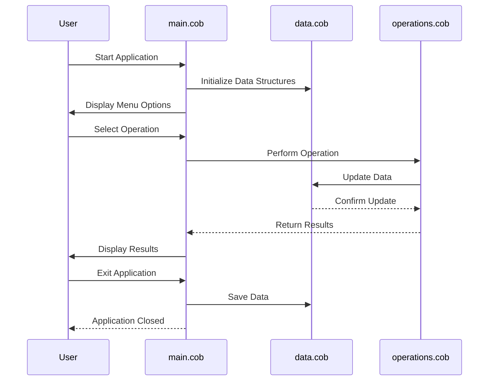

# COBOL Project Documentation

## Purpose of the COBOL Files

### `data.cob`
This file is responsible for managing the data structures and storage mechanisms used in the application. It defines the layout of records, including fields for student accounts, such as:
- Student ID
- Name
- Account Balance
- Transaction History

### `main.cob`
This is the main entry point of the COBOL application. It orchestrates the overall workflow of the program, including:
- Initializing the application
- Calling other modules (e.g., `data.cob` and `operations.cob`)
- Handling user inputs and outputs

### `operations.cob`
This file contains the core business logic and operations related to student accounts. Key functions include:
- Adding new student accounts
- Updating account balances
- Processing transactions
- Generating reports

## Business Rules
The application enforces the following business rules for managing student accounts:
1. **Unique Student IDs**: Each student account must have a unique identifier.
2. **Non-Negative Balances**: Account balances cannot go below zero.
3. **Transaction Logging**: All transactions must be logged for auditing purposes.
4. **Report Generation**: The system must generate periodic reports summarizing account statuses and transactions.

## Directory Structure
```
Week4-lab/
├── src/
│   ├── cobol/
│   │   ├── data.cob
│   │   ├── main.cob
│   │   ├── operations.cob
├── docs/
│   ├── README.md
```

## Sequence Diagram

